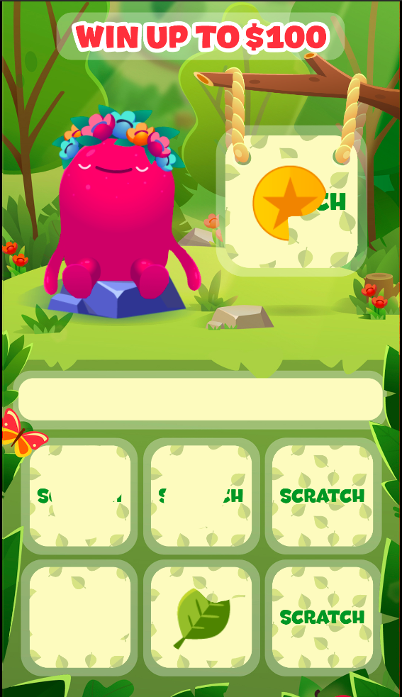
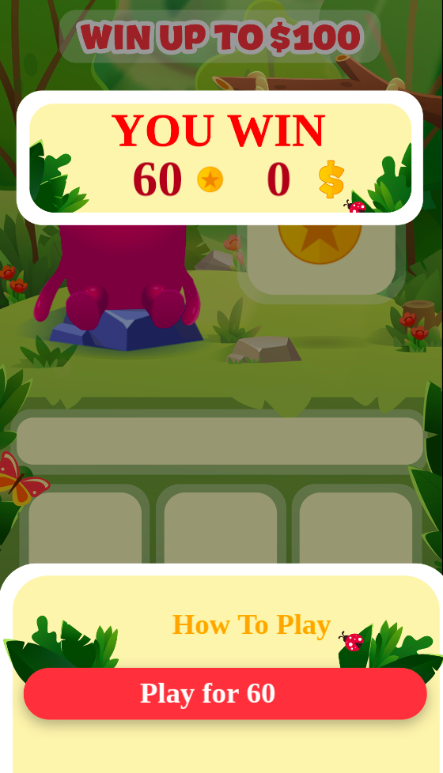

# Description

Example use **redux** with **pixijs**

# How use

### Run dev mode
```
npm start
```
Then go to http://localhost:8080

### Make build
```
npm run build
```

# Description game

Card size 3*2 fields + filed for bonus
Classic scratcher game where User needs to find 3 symbols to win coins/cash.
Also User has a bonus filed which will contain some guaranteed prize
 User scratches the field to check the symbols, in case 3 symbols are the same – User gets a payout.

## Screenshots



